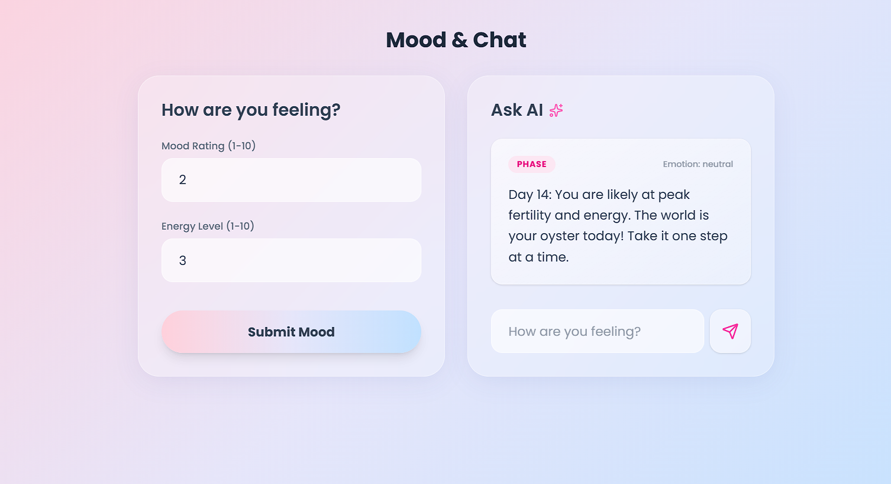
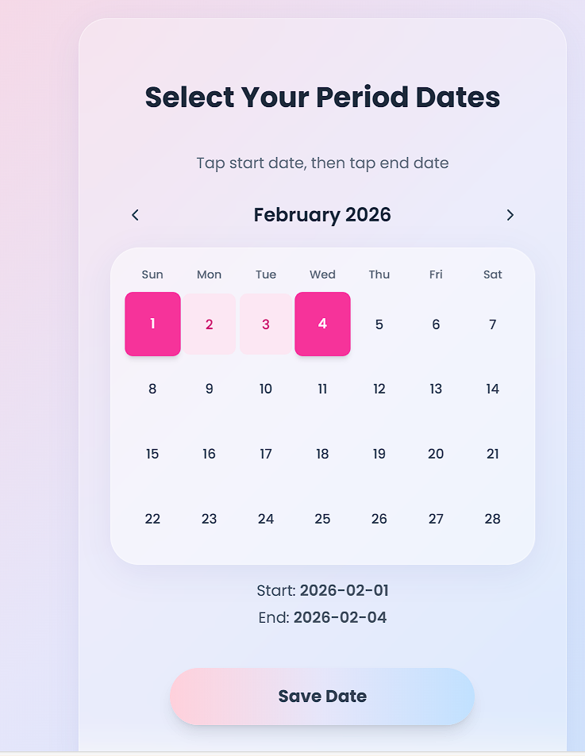

<p align="center">
  
</p>

# 🌸 HerSpace 🎯

## Basic Details

### Team Name: Echo

### Team Members
- **Maria Mejo** – Christ College of Engineering  
- **Sanit A Ambookkan** – Christ College of Engineering  

---

### 🌐 Hosted Project Link
👉 *[Add your deployed Vercel link here]*  

---

## 📌 Project Description

HerSpace is a women-centric wellness web application designed to help users track their menstrual cycle, mood levels, and energy levels. The platform provides intelligent suggestions and visual insights to promote emotional awareness and better daily planning.

---

## ❗ The Problem Statement

Many women experience fluctuations in mood and energy during their menstrual cycle but lack a structured digital solution to track patterns and understand how their cycle affects productivity and well-being.

---

## 💡 The Solution

HerSpace offers:

- Period tracking  
- Mood and energy level logging  
- Smart activity suggestions based on emotional and physical state  
- Dashboard analytics for pattern recognition  

By combining tracking with intelligent feedback, HerSpace empowers users to better understand and manage their well-being.

---

# 🛠 Technical Details

## Technologies / Components Used

### 💻 Languages
- JavaScript
- TypeScript
- SQL

### ⚙️ Frameworks
- Next.js
- Node.js
- Express.js

### 📚 Libraries
- MySQL2

### 🧰 Tools
- VS Code
- Git & GitHub

# ✨ Features

- 📅 Period tracking system  
- 😊 Mood level logging  
- ⚡ Energy level tracking  
- 🧠 Smart suggestions based on mood + energy combination  
- 📊 Dashboard insights and data visualization  
- 🔐 Backend API integration with MySQL database  

---

# 🚀 Implementation

## Installation

```bash
git clone https://github.com/your-username/HerSpace.git
cd HerSpace
```

### Backend Setup

```bash
cd backend
npm install
```

### Frontend Setup

```bash
cd frontend
npm install
```

---

## Run

### Start Backend

```bash
npm start
```

### Start Frontend

```bash
npm run dev
```

---

## 🗄 Database Setup

Run the SQL file located at:

backend/database/schema.sql

Create a `.env` file inside the backend folder:

```
DB_HOST=your_host
DB_USER=your_user
DB_PASSWORD=your_password
DB_NAME=your_database
PORT=5000
```

---

# 📸 Screenshots


Dashboard displaying mood, energy, and period insights


Mood and energy logging interface


Period tracking calendar view

<p align="center">
  
</p>
<p align="center">
  
</p>
<p align="center">
  
</p>

---

# 🏗 System Architecture

User  
↓  
Frontend (Next.js – Vercel)  
↓  
Backend API (Node.js + Express – Render)  
↓  
MySQL Database (Railway)

The frontend communicates with the backend through REST APIs.  
The backend handles business logic and securely interacts with the MySQL database.

---


# 🎥 Project Demo

### Video
👉 *[Add your demo video link here]*  

The demo showcases:
- Logging mood and energy  
- Viewing dashboard insights  
- Period tracking functionality  
- Backend data persistence  

---

# 🤖 AI Tools Used (Transparency)

Tool Used: ChatGPT  

Purpose:
- Backend debugging  
- Suggestion logic structuring  
- Deployment guidance  
- Documentation refinement  

Estimated AI assistance: ~30–40%  

Human Contributions:
- System architecture design  
- Backend implementation  
- Frontend UI/UX design  
- Feature logic development  
- Integration and testing  

---

# 👩‍💻 Team Contributions

Maria Mejo
- Backend development  
- API creation  
- Database integration  

Sanit A Ambookkan
- Frontend development  
- UI/UX design  
- Mood & energy logic implementation  
- Documentation  
---

# 📜 License

This project is licensed under the MIT License.

---

Made with ❤️ at TinkerHub
